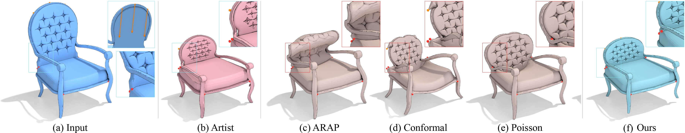

# Slippage-Preserving Reshaping of Human-Made 3D Content


This repository contains the codebase for the paper titled "Slippage-Preserving Reshaping of Human-Made 3D Content" published in SIGGRAPH Asia 2023. For more details and to download the paper, please visit the [project website](https://www.cs.ubc.ca/labs/imager/tr/2023/3DReshaping/).

**Slippage-Preserving Reshaping of Human-Made 3D Content**<br>
[Chrystiano Araújo](https://www.cs.ubc.ca/~araujoc/), [Nicholas Vining](https://www.cs.ubc.ca/~nvining/), [Silver Burla](https://silverburla.com/), [Manuel Ruivo de Oliveira](), [Enrique Rosales](https://www.enrique-rosales.com/), and [Alla Sheffer](http://www.cs.ubc.ca/~sheffa/) <br>
ACM Transaction on Graphics (Proceedings of SIGGRAPH Asia 2023) <br>

## Installation
Clone this repository to get started.
```
git clone https://github.com/chrystianosaraujo/slippage-preserving-reshaping.git
```

Only Windows build is supported at the moment (specifically tested on Visual Studio 2022 [v143]). Stay tuned for updates as we add support to other platforms.

Besides the MSVC compiler, the only dependency is cmake, as our build system automatically downloads all other dependencies.

## Compilation
Use the following instructions to build in release mode.

```
cd [PROJECT_ROOT]
mkdir build
cd build
cmake -DCMAKE_BUILD_TYPE=Release ..
```

Now, either open the VS project or build it directly from command line as follows:

```
cmake --build . --config Release
```

## Project Structure
```
README.md
include
source
apps
    reshaping_app
    reshaping_demo
models
```
+ The reshaping library codebase can be found in the `./include` and `./source` folders.
+ The `./apps/reshaping_demo` directory contains a demo example demonstrating how to use the reshaping library.
+ The `./apps/reshaping_app` directory contains a full GUI-based app that utilizes the reshaping library. See the `Usage` section for details on how to use it.
+ The `./apps/models` directory contains input examples for reshaping tasks. Each obj file is accompanied by the following files:
    +  `.fk`: precomputed per-face curvatures
    +  `.deform`: pre-defined edit operations. Each operation is identified by a unique label.
    +  `.cam`: pre-defined camera settings for each edit operation label defined in the `.deform` file
    +  `.straight`: optional file containing straightness information

After building the project, the reshaping lib, and reshaping_app and reshaping_demo executables can be found as follows:
+ `mesh_reshaping_lib.lib` can be found under `./build/Release`
+ `reshaping_demo.exe` can be found under `./build/apps/reshaping_demo/Release/`
+ `reshaping_app.exe` can be found under `./build/apps/reshaping_app/Release/`

## Usage

### mesh_reshaping.lib
Check the `./apps/reshaping_demo` folder for a demo example of how to use the reshaping library.

### reshaping_demo
To run the reshaping app demo, run `reshaping_demo.exe -i <input_fn> -o <output_dir> -e <edit_operation_label>`

+ `<input_fn>`: input mesh filename (obj)
+ `<output_dir>`: directory where all output files will be saved. 
+ `<edit_operation_label>`: label identifying an edit operation that must be loaded from the model `.deform` file. If no label is provided (no `-e` argument used), all the available edit operations will be listed for further use.

Once finished, the output folder will contain obj files for input (`_input.obj`), displaced points (`_handles.obj`), fixed points (`_fixed_points.obj`), and the final reshape surface (`_output.obj`).


